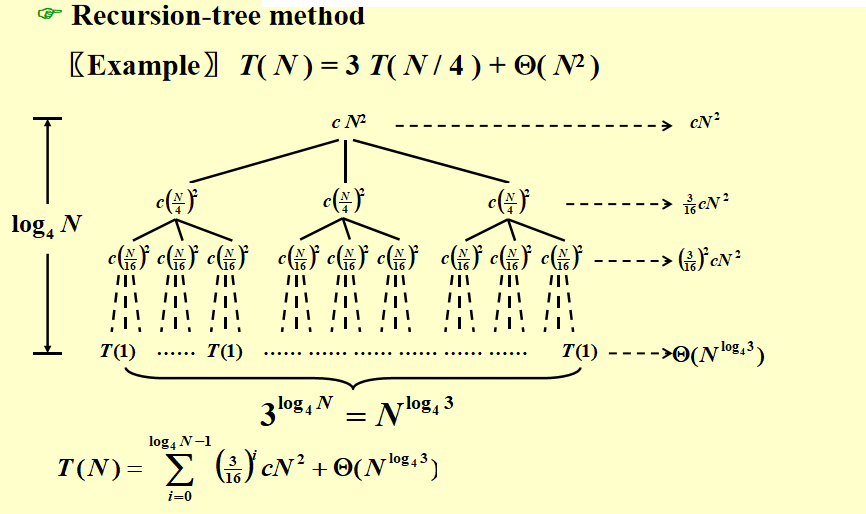

# Algorithm
## 1. Backtracking(回溯法)
### 1.1 回溯法的基本思想
考虑所有可能的情况进行逐一验证，在验证的过程中进行合理的剪枝(pruning)。
### 1.2 八皇后问题
目标:在棋盘中找到八个位置放置皇后，使得它们都不同行且不同列，也不能同时位于对角线上
使用game tree的方式来表示回溯的过程：对于n个皇后的问题有n！种不同的情况需要验证
剪枝：$x_i != x_j \;\;\; if\;\;\; i \neq j \qquad (x_i - x_j)/(i - j) \neq \pm1$

### 加油站问题
+ 目标：在一条直线上找到n个地方建立加油站，已知它们两两之间的距离，求出所有加油站的位置，假定第一个加油站的坐标是0
+ 解决方式
  - 有$\frac{n(n-1)}{2}$个距离和n个加油站
  - 首先需要根据加油站的数量计算出n的大小
  - 有一个list是两两之间的距离
  - 先将第一个加油站和最后一个加油站的位置确定，并将已经可以计算出的距离从路径中删除
  - 找到剩下的距离中最大的距离并检验，最大距离一定是新加入的点和端点之间的距离，不断重复上述过程，如果检验失败则回到上一种情况，恢复原本被删除的距离再往下回溯
    + 每次检验分成靠近左边和靠近右边两种情况

+ 代码实现
```c
    bool Reconstruct ( DistType X[ ], DistSet D, int N, int left, int right )
    { /* X[1]...X[left-1] and X[right+1]...X[N] are solved */
        bool Found = false;
        if ( Is_Empty( D ) )
            return true; /* solved */
        D_max = Find_Max( D );
        /* option 1：X[right] = D_max */
        /* check if |D_max-X[i]| in D is true for all X[i]’s that have been solved */
        OK = Check( D_max, N, left, right ); /* pruning */
        if ( OK ) { /* add X[right] and update D */
            X[right] = D_max;
            for ( i=1; i<left; i++ )  Delete( |X[right]-X[i]|, D);
            for ( i=right+1; i<=N; i++ )  Delete( |X[right]-X[i]|, D);
            Found = Reconstruct ( X, D, N, left, right-1 );
            if ( !Found ) { /* if does not work, undo */
                for ( i=1; i<left; i++ )  Insert( |X[right]-X[i]|, D);
                for ( i=right+1; i<=N; i++ )  Insert( |X[right]-X[i]|, D);
            }
        }
        /* finish checking option 1 */
        if ( !Found ) { /* if option 1 does not work */
            /* option 2: X[left] = X[N]-D_max */
            OK = Check( X[N]-D_max, N, left, right );
            if ( OK ) {
                X[left] = X[N] – D_max;
                for ( i=1; i<left; i++ )  Delete( |X[left]-X[i]|, D);
                for ( i=right+1; i<=N; i++ )  Delete( |X[left]-X[i]|, D);
                Found = Reconstruct (X, D, N, left+1, right );
                if ( !Found ) {
                    for ( i=1; i<left; i++ ) Insert( |X[left]-X[i]|, D);
                    for ( i=right+1; i<=N; i++ ) Insert( |X[left]-X[i]|, D);
                }
            }
            /* finish checking option 2 */
        } /* finish checking all the options */
        
        return Found;
    }
```

### 回溯算法的一种模板
```c
bool Backtracking ( int i )
{   Found = false;
    if ( i > N )
        return true; /* solved with (x1, …, xN) */
    for ( each xi in Si ) { 
        /* check if satisfies the restriction R */
        OK = Check((x1, …, xi) , R ); /* pruning */
        if ( OK ) {
            Count xi in;
            Found = Backtracking( i+1 );
            if ( !Found )
                Undo( i ); /* recover to (x1, …, xi-1) */
        }
        if ( Found ) break; 
    }
    return Found;
}
```

回溯方式的选择：在不会互相依赖的情况下，应该选择从少到多的回溯方式，这样在剪枝的情况下可以排除更多的情况 ，剪枝力度大。但是如果彼此选择依赖很大的时候，不一定

### AI下棋 Tic-tac-toe
- 需要推算出所有可能的情况并选择当前胜率最高的情况往下走
- Minimax Strategy 最大最小策略
  + 人需要最小化当前情况P的可能赢的情况，而AI要将它最大化
  + goodness函数$f(P)=W_{AI}-W_{Human}$ ，W是当前情况下某一方可能赢的所有结果，不需要考虑另一
  + 方后面会怎么下，只要自己猛下，只要计算自己在当前局势下的任何可以赢的方

#### 剪枝 α-β pruning
- α pruning
  
  对于图中的max层来说，它要取下一层也就是min层的最大值，因为函数是从左到右遍历的，max层已经取到了左边部分的最大值44，而此时如果min层的后续节点会得到小于44的值就可以直接进行剪枝。
- β pruning
  
  和上述类似，对于min层来说，要取下一层也就是max层的最小值，而此时的68已经大于44了，就可以直接进行剪枝。

当α-β pruning被一起使用时，就可以将一个节点个数为N的游戏树限制在搜索$O(\sqrt[]N)$

## 2. Divide & Conquer(分治法)
### 基本概念
- 分解成若干个子问题——>分别解决——>最后再一起算
- 递归的解决问题
  + $T(N)=aT(N/b)+f(N)
- 一些例子
  + 最大子序列问题 —— $O(N\log N)$
    - 找两边最大的，然后找横跨的最大的
    - 横跨的是从中间往两边找最大的
  + 树的遍历 —— $O(N)$
    - 给出一棵树的中序遍历和后序遍历，把树给画出来；不断地取后序的最后一个点，把中序分成两部分
  + 归并排序和快速排序 —— $O(N\log N)$

### Closest Point Problem最近点对问题
#### 简单的暴力搜索
遍历$\frac{N(N-1)}{2}$个点对，$T=O(N^2)$
#### 分治法
将每个点按照x坐标排成一列，分为三个部分，左最近点对、右最近点对和分离最近点对，关键在于线性时间找到分离最近点对。我们首先取x坐标来看的中点，其x坐标记为$\bar x$，然后考虑$[\bar x - \delta,\bar x + \delta]$（$\delta$是左右两半中最近点对的距离）之间的所有点，将它们按照y坐标排成一列，对于其中$q_i$的纵坐标为$y_i$的点，只需要对$q_i$检查x坐标在$[\bar x - \delta,\bar x + \delta]$，y坐标在$[y_i,y_i + \delta]$之间构成的长方形区域中的所有点是否有更近的点即可（所有点都往上找就行，往下和下面的点往上找重合）。我们将这个长方形区域分为平均分割为 8 块，则每块内最多出现一个点，否则每块内两点距离不超过$\frac{\sqrt[]{2}}{2}\delta$，并且每块都不跨中点，这与$\delta$是左右两半中最近点对距离矛盾，因为我们可以找到距离更短的两点。所以对于每个$q_i$，我们只需找向上 7 个点即可，所以找分离最近点对的时间复杂度是线性的。所以$T(N)=2T(N/2)+7N$。部分代码如下
```c
for ( i = 0; i < NumPointsInStrip; i++ )
    for ( j = i + 1; j < NumPointsInStrip; j++ ) 
        if ( Dist_y( Pi , Pj ) > \delta )
	        break;
        else  if ( Dist( Pi , Pj ) < \delta )
	        \delat = Dist( Pi , Pj );
```
### 计算分治法的时间复杂度
对于递推式$T(N)=aT(N/b)+f(N)$，计算时间复杂度有三种方法。不过我们需要忽略一些细节
- 无论(N/b)是否是整数
- 总是假设$T(n)=\Theta(1)$
#### Substitution method(代入法)
先猜测答案，然后用数学归纳法证明

猜错的情形：

因为猜测的O(N)是严格小于cN的，最后证出的(c+1)N是错误的。

#### Recursion-tree method(递归树法)
递归树法并不是一个严格的证明，可以用于进行辅助猜测，将递推式展开几层，得到一个猜测的结果后使用代入法进行证明。

所有叶子节点的代价是O(1)，内部结点的代价是将其孩子节点进行合并，所以总代价是叶子节点+内部节点


#### Master method(主定理)


无论什么形式的主定理，其实关键都在于比较 $n^{\log_b a}$ 和f(n)之间的关联，如果前者大，则前者 “掌控了” 整个时间复杂度，所以时间复杂度就是 T(n) = aT(n/b) 对应的复杂度，这也很符合直观，因为此时 a 比较大，分叉比较多，树比较大（结
合前面递归树的例子），所以更大的复杂度会落在叶子上；反之后者大则每一层的复杂度 “掌控了” 整个时间复杂度，故整体时间就是 f(n) 级别的。这也就是 “主定理” 这一名字的含义，十分形象，就是看前后两半谁 master 了整体时间复杂度。


## 3. Dynamic Programming(动态规划)
### 基本概念
一个问题，它的最优解可以表达为一些合适的子问题的最优解的递推关系，则我们称这一问题具有最优子结构性质（因为大问题的最优解可以直接依赖于小问题的最优解）。然后我们求解这一递推式，通过设置好 base case（这里我们也用 base case 指代最简单的情况，但注意这时不是递归了），然后通过记忆化的方法，使用迭代算法而非费时的递归算法避免冗余计算，得到一个时间复杂度令人满意的算法，这就是动态规划的基本想法。
动态规划方法通常用来求解最优化问题（optimization problem）。这类问题可以有很多可行解，每个解都有一个值，我们希望寻找具有最优值（最小值或最大值）的解。我们称这样的解为问题的一个最优解（an optimal solution），而不是最优解（the
optimal solution），因为可能有多个解都达到最优值。我们通常按如下 4 个步骤来设计一个动态规划算法：
1. 刻画一个最优解的结构特征；
2. 递归地定义最优解的值；
3. 计算最优解的值，通常采用自底向上的方法；
4. 利用计算出的信息构造一个最优解。

步骤 1-3 是动态规划算法求解问题的基础。如果我们仅仅需要一个最优解的值，而非解本身，可以忽略步骤 4 。如果确实要做步骤 4, 有时就需要在执行步骤 3 的过程中维护一些额外信息，以便用来构造一个最优解。
事实上动态规划就是为一个具有所谓最优子结构性质（即原问题最优解可以由子问题最优解递推得到）的最优化问题寻找一个子问题到原问题的递推式，然后用记忆化方法求解，最后有时我们需要构造出这一最优解。

### 加权独立集合问题
#### 问题描述
考虑一个无向图 G，其上所有点都在一条线上（这种图我们称其为路径图），每个点都有一个非负权重。我们称 G 的独立集合是指顶点互不相邻的子集（换句话说独立集合不会同时包含一条边上的两个点），然后要求解一个具有最大顶点权重和的独立集合。

#### 最优子结构
在考虑动态规划的题目时，我们最重要的是想出最后一步要做什么，在这道题中，如果我们把顶点按编号排成一列，那么最后一步就是最后一个点要不要加入到最优解中，这样最后一步就可以分为两种情况：
1. 如果$v_n$不在最优解 S 中，那么 S 实际上可以看成前 n − 1 个点构成的路径图$G_{n-1}$组成的子问题的一个最优解。
2. 如果$v_n$在最优解 S 中，那么由于是独立集合问题，那么$v_{n-1}$就不能在最优解中，因为$v_{n-1}$和$v_n$相邻。所以类似于第一种情况的分析，$S − {v_n}$ 一定是前 n − 2 个点构成的路径图$G_{n-2}$的最优解，所以整个问题的最优解就是$G_{n-2}$的最优解加上$v_n$。

由此就可以写出递推关系式 $W_i=max\{W_{i-1},W_{i-2}+w_i\}$

#### 代码实现
```c
int a[n+1] = {0}; //subproblem solutions
a[0] = 0;         //base case #1
a[1] = w_1;        //base case #2
for(int i = 2;i <= n;i++)
    a[i] = max{a[i-1],a[i-2]+w_i};
return a[n];
```

很显然，这一算法的时间复杂度是 $O(n)$，是一个非常高效的算法。

#### 解的重构
我们还剩下动态规划框架的最后一步，即有时候我们可能不仅需要最优解的值，还需要最优解本身包含了哪些点，这就需要解的重构。如果 $W_n = W_{n−1}$，那么最后一个点不在最优解中，此时我们回退一格，继续重建图 $G_{n−1}$ 的最优解；否则最后一个点在最优解中，我们会退两格重建图 $G_{n−2}$ 的最优解。


上面通过一个简单的例题讲解了动态规划解题的一般步骤，更多的例题解析可以参考ppt和wyy的讲义。或者后续有时间也可以进行补充。