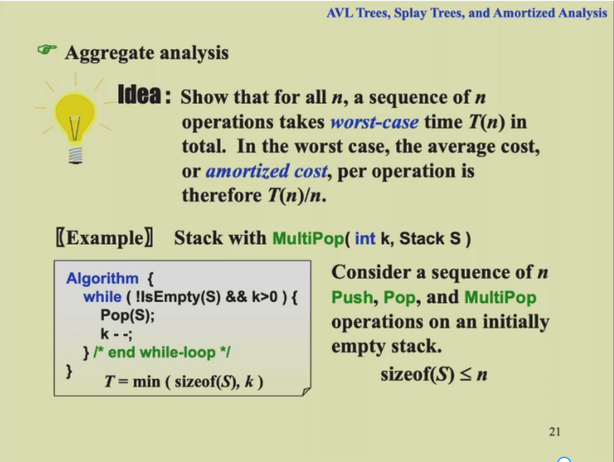
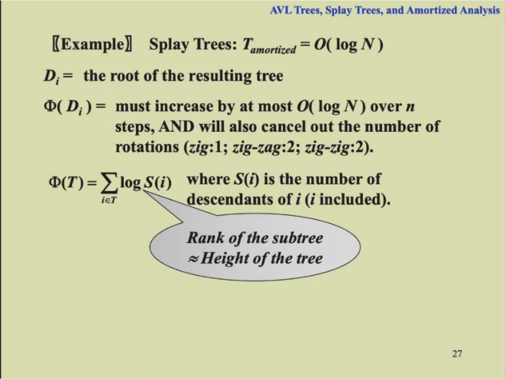

# 1. AVL Trees,Splay Trees,and Amortized Analysis
## 1.1 AVL Trees
### 1.1.1 AVL树的定义（height balanced的定义）
- 空树是height balanced的
- 对于任何一个节点，左右子树的高度差的绝对值不超过1（把高度控制在 O(logn)）
  + 高度的定义：空节点的高是-1，没有儿子的节点(学名是叶节点)高为0，否则就是儿子中高的最大值+1

### 1.1.2 balance factor(平衡因子)的定义
The balance factor BF(node) = h~L~ - h~R~.In an AVL tree,BF(node) = -1,0,or1.
### 1.1.3 树的旋转
当高度差的约束被打破的时候（插入、删除操作的时候）就需要进行旋转，有LL,RR,LR,RL四种旋转方式，一般是自下向上第一个出问题的节点是要旋转子树的根节点。
代价：交换指针
时间复杂度：O(1)

#### 1.1.3.1 RR旋转

当新插入的节点在平衡因子被打破的节点的右子树的右子树时，使用RR旋转，旋转平衡因子被打破的节点的右儿子。
#### 1.1.3.2 LL旋转

当新插入的节点在平衡因子被打破的节点的左子树的左子树时，使用LL旋转，旋转平衡因子被打破的节点的左儿子。

#### 1.1.3.3 LR旋转

当新插入的节点在平衡因子被打破的节点的左子树的右子树时，使用LR旋转，将平衡因子被打破的节点的左儿子的右儿子旋转两次旋转到最上方。

#### 1.1.3.4 RL旋转

当新插入的节点在平衡因子被打破的节点的右子树的左子树时，使用RL旋转，将平衡因子被打破的节点的右儿子的左儿子旋转两次旋转到最上方。

### 1.1.4 树高和节点数的关系
给定树高h，计算最小节点数（n~h~），给定节点数，求最深深度。
- 画图分析可知：n~h~ = n~h-1~ + n~h-2~ + 1，即左子树节点数 + 右子树节点数 + 根（左右节点一定不一样）
- 斐波那契数列：F~0~ = 0，F~1~ = 1，F~i~ = F~i-1~ + F~i-2~
- n~h~ = F~h+3~ - 1，所以n~0~ = 1，n~1~ = 2。
- 通过斐波那契数列的通项公式得：$$n_h=\frac{1}{\sqrt[]5}(\frac{1+\sqrt[]5}{2})^{h+3}-1$$
- 由此可知 $$h=O(logn)$$

## 1.2 Splay Trees
### 1.2.1 特点
- 不一定平衡的二叉树，比AVL Tree简单，解决的问题是和AVL Tree一样的
- 每访问一次某节点就会将该节点移动到根部
- 必须要从一棵空树开始
- 不需要每一次都是O(logN)，但是我们可以做到摊还下来时间复杂度仍是O(logN)，让最坏的情况不常发生
- 不要求保留高度或平衡信息，因此它在某种程度上节省空间并简化代码
- M次连续操作的总复杂度为：O(MlogN)

### 1.2.2 目标
从空树开始，任何M次连续的操作一共最多消耗O(MlogN)的时间。在树中，每次有节点被访问到，就将其旋转到根节点（符合实际，当一个点被访问到后，很有可能不久之后还会被访问到）

### 1.2.3 旋转方法
我们假设P是父亲，G是祖父，X是儿子
- 如果父节点是根节点，直接把父子旋转即可
- 如果父节点不是根节点（当前开销大，但是对未来更好）
  

- zig-zag：即LR或RL双旋（转两次X）
- zig-zig：即两次LL或RR单旋（先转P再转X）

每次将被访问的节点按照上述规则旋转到根节点上为止

### 1.2.4 查找
- 找到节点
- 找到后通过基本操作调整至根部
- 单次最差复杂度：O(N)
- 摊还单次复杂度：O(logN)
  
### 1.2.5 插入
- 找到合适位置
- 插入后通过基本操作调整至根部，需要做splay
- 摊还单次复杂度：O(logN)
  
### 1.2.6 删除
- 找到要删除的节点X并将其旋转到根节点
- 把根节点删除，产生左右两棵子树
- FindMax在左子树上找到最大的节点旋转到根节点，并且把右子树接到左子树的右边（或者右子树的最小
值，同理）

## 1.3 均摊分析( Amortized Analysis)
Amortized time bonud定义：Any M consecutive operations take at most O(Mlog N) time
最坏情况边界 > 均摊边界 > 平均情况边界
>平均情况边界不能保证上述定义，和概率，期望有关
>均摊复杂度和概率，期望无关
### 1.3.1 均摊分析的方法
#### 1.3.1.1 聚合分析(Aggregate analysis)
确定n个操作的总代价上界为T(n)，单次平均代价为T(n)/n。
聚合分析和核算法的不同是核算法假设了每一种操作的摊还代价可能不一样

T~amoritized~ = O(n)/n = O(1)
#### 1.3.1.2 核算法(Accounting method)
将操作序列中较早操作的余额作为“信用credit”存储，与数据结构的特定对象关联，随后用于支付摊还代价与实际代价的差额。

#### 1.3.1.3 势能法(Potential method)
与核算法类似，分析每个操作的代价，但是将势能作为一个整体函数，与某个对象无关。操作的摊还代价的计算为操作实际代价加上操作引起的势能变化（credit）。

### 1.3.2 使用均摊法的势能法计算splay树的复杂度
>公式：如果a+b<=c，且a和b均是正整数，则有loga + logb <= 2*logc - 2

其中S(i)是子树中的所有节点个数，logS(i)是子树的rank(秩)。

一共有三个操作(注意保证后两个操作的均摊值不要有常数):
- R1是之前的,R2是现在的
- Single rotation：我们希望最后结果和X有关，所以放缩了P点的
- Zig-Zag：同理，也放缩到了只和X有关，使用引理将R2(P)和R2(G)换成了2*R2(X)-2，然后将R1(P)放缩成了R1(X)。
- Zig-Zig：同理，只是需要加减一个R1(X)，与R2(G)合作放缩成R2(X)，后面同理。

>得到结论：The amortized time to splay a tree with root T at node X is at most 3*(R(T)-R(X))+1 = O(logN).

