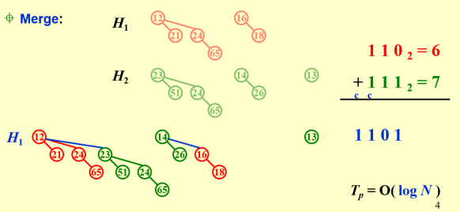
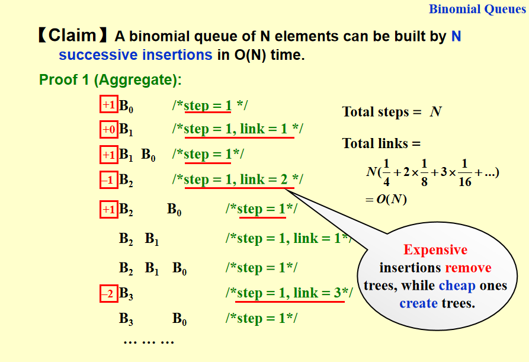
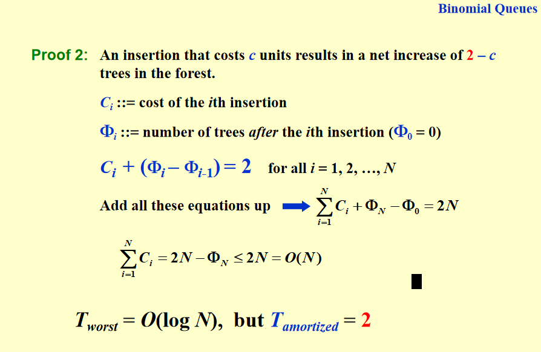

# 二项队列(binomial queue)
>
## 二项队列的定义
1. 结构性质：
(a) 二项堆不再是一棵树，而是多棵树构成的森林，其中每一棵树都称为二项树；
(b) 一个二项堆中的每棵二项树具有不同的高度（即每一个高度最多对应一棵二项树）；
(c) 高度为 0 的二项树是一棵单节点树；高度为 k 的二项树 $B_k$ 通过将一棵二项树 $B_{k−1}$ 附接到另一棵二项树 $B_{k−1} 的根上而构成，这一点根据 PPT 上的图非常直观。
2. 序性质：每棵二项树都保持堆的序性质，例如是最小堆（本节无特殊说明都默认最小堆）则根结点最小，孩子都比父亲大。
3. 二项树 $B_k$ 实际上就是由一个带有儿子 $B_0$, $B_1$, · · · ,$B_{k−1}$的根组成。我们很容易根据定义归纳得到高度为 k 的二项树恰好有 $2^k$ 个节点，而且在深度 d 处的节点数恰好就是二项系数$\binom{k}{d}$
   
## 二项队列的操作
### 节点定义
```c
typedef struct BinNode *Position;
typedef struct Collection *BinQueue;
typedef struct BinNode *BinTree;
struct BinNode
{
int Element;
Postion LeftChild;
Postion NextSibling;
};
struct Collection
{
int CurrentSize;
BinTree TheTrees[ MaxTrees ];
} ;
```
!!! 注意
    在二项树中，根节点的子节点是按照高度从大到小排序的，便于与另一个树合并时直接插在最左边。
### FindMin
直接遍历全部 $O(\log n)$ 棵树的根结点即可，因此时间复杂度是 $O(\log n)$。当然也可以通过专门记录最小的根结点来实现 $O(1)$ 的时间复杂度，只是每次DeleteMin或插入后要更新这一值。（考试时都是对的）

### merge
将两个高度相同的二项队列进行合并，必须保证队列中每棵二项树按高度从小到大排好序。

将两棵高度相同的二项树合并成新的二项树，取小的作为根节点，如果有三棵树(进位产生了一棵)则随机选两棵树合并。
merge 操作实际上就是从最小的堆开始（对应二进制最低位），如果无需进位（表明是 1+0 或 0+1）则直接留下称为新堆的一部分，如果需要进位则表明是 1+1，因此做合并后进位与下一位做加法，如此循环直到最高位完成操作。时间复杂度很显然就是 $O(\log n)$，因为就是二进制逐位做操作。

#### 两个二项树合并的算法
```c
BinTree CombineTrees( BinTree T1, BinTree T2 )
{ /* merge equal-sized T1 and T2 */
    if ( T1->Element > T2->Element )
/* attach the larger one to the smaller one */
        return CombineTrees( T2, T1 );
/* insert T2 to the front of the children list of T1 */
    T2->NextSibling = T1->LeftChild;
    //T2肯定比T1的子树大，所以T2在左边
    T1->LeftChild = T2;
    //儿子从大到小排序，只需要两步操作
    return T1;
}
```

#### merge算法
```c
BinQueue Merge( BinQueue H1, BinQueue H2 )
//Carry是从上一步进位来的树（可能是NULL）
{ 
    BinTree T1, T2, Carry = NULL;
    int i, j;
    if ( H1->CurrentSize + H2-> CurrentSize > Capacity )    ErrorMessage();
    H1->CurrentSize += H2-> CurrentSize;
    //j×2，×2来，一个一个挪(从位的角度来看)
    for ( i=0, j=1; j<= H1->CurrentSize; i++, j*=2 ) {
        T1 = H1->TheTrees[i];
        T2 = H2->TheTrees[i]; /*current trees */
        switch( 4*!!Carry + 2*!!T2 + !!T1 )
        //如果T1存在，则!T1是1,!!T1是1，将指针转化成数字
        {
        case 0: /* 000 */
        case 1: /* 001 */ break;
        case 2: /* 010 */ H1->TheTrees[i] = T2;H2->TheTree[i] = NULL;break;
        case 4: /* 100 */ H1->TheTrees[i] = Carry; Carry = NULL; break;
        case 3: /* 011 */ Carry = CombineTrees( T1, T2 );H1->TheTrees[i] = H2->TheTrees[i] = NULL; break;
        case 5: /* 101 */ Carry = CombineTrees( T1, Carry );H1->TheTrees[i] = NULL; break;
        case 6: /* 110 */ Carry = CombineTrees( T2, Carry );H2->TheTrees[i] = NULL; break;
        case 7: /* 111 */ H1->TheTrees[i] = Carry;Carry = CombineTrees( T1, T2 );H2->TheTrees[i] = NULL; break;
        } /* end switch */
    } /* end for-loop */
    return H1;
}
```
有一个细节是 for 循环的终止条件，是由变量 j 控制的，这里需要稍微理解一下，实际上很简单，就是等价地确定最多会循环多少次。

### insert
插入（insert）是合并的特殊情况，操作不在此赘述，时间复杂度最坏为 O(log n)，但从空开始建堆的时间复杂度是常数的。
#### insert的摊还分析
##### 聚合法
聚合法需要每一步的操作复杂度，实际上我们随便模拟几步再结合之前讨论的合并和二进制加法之间的关系就可以发现，插入的整个操作与二进制数加 1 有完全的对应关系：若是遇到了某一位是 1+1，则用常数操作完成简单的合并即可，如果遇到 0+1，那么当前所有的二项树合起来就是最后的结果。基于这一观察我们知道，因为 0+1 对应将 0 置 1，1+1 对应 1 置 0，这两种情况都对应于堆的常数时间操作，因此从空树连续插入 n 个节点的时间复杂度是 0 + 1 + 1 · · ·（n 个 1）的过程中数据二进制表示中 0 和 1 比特翻转的次数总和。
于是算法复杂度就很好计算了，因为我们知道 n 对应于$ \lfloor {\log n} \rfloor+1 $个二进制位，事实上最低位每次加1 都会反转比特，次低位每两次运算反转比特，倒数第三位每 4 次运算反转比特...... 以此类推，n 次操
作的整体时间复杂度与
$$ n+\frac{n}{2}+\frac{n}{4}+···+\frac{n}{2^{\lfloor {\log n} \rfloor+1}} $$
成正比，根据等比数列求和可知上述求和是小于 2n 的（取 n → ∞ 才能到 2n），所以单步操作的常数摊还时间$o(1)$也就得到了。


##### 势能法

从一个空的二项队列开始插入N个元素最多消耗$O(N)$的时间，因此均摊到每一个操作上的时间复杂度是常数时间$O(1)$。

### DeleteMin
DeleteMin 操作在 PPT 第 6 页也展示得很清楚了，实际上就是先用 $O(\log n)$ 的时间找到根的最小值（或 $O(1)$，但这表明最后还需要更新最小值），设根最小的堆对应 $B_k$，于是我们可以得到两个堆，其一是整个二项堆移除 $B_k$ 后剩下的堆，其二是 $B_k$ 移除根结点后得到的堆，将这两个堆合并即可，时间复杂度显然是 $O(\log n)$。
```c
ElementType DeleteMin( BinQueue H )
{ 
    BinQueue DeletedQueue;
    Position DeletedTree, OldRoot;
    ElementType MinItem = Infinity; /* the minimum item to be returned */
    int i, j, MinTree; /* MinTree is the index of the tree with the minimum
    item */
    if ( IsEmpty( H ) ) { PrintErrorMessage(); return –Infinity; }
    for ( i = 0; i < MaxTrees; i++) { /* Step 1: find the minimum item */
        if( H->TheTrees[i] && H->TheTrees[i]->Element < MinItem ) 
        {
            MinItem = H->TheTrees[i]->Element; MinTree = i; 
        } /* end if */
    } /* end for-i-loop */
    DeletedTree = H->TheTrees[ MinTree ];
    H->TheTrees[ MinTree ] = NULL; /* Step 2: remove the MinTree from H => H’ */
    OldRoot = DeletedTree; /* Step 3.1: remove the root */
    DeletedTree = DeletedTree->LeftChild; free(OldRoot);
    DeletedQueue = Initialize(); /* Step 3.2: create H” */
    DeletedQueue->CurrentSize = ( 1<<MinTree ) – 1; /* 2MinTree – 1 */
    for ( j = MinTree – 1; j >= 0; j – – ) {
        DeletedQueue->TheTrees[j] = DeletedTree;
        DeletedTree = DeletedTree->NextSibling;
        DeletedQueue->TheTrees[j]->NextSibling = NULL;
    } /* end for-j-loop */
    H->CurrentSize –= DeletedQueue->CurrentSize + 1;
    H = Merge( H, DeletedQueue ); /* Step 4: merge H’ and H” */
    return MinItem;
}
```

## 各种堆的比较

| |二叉堆|左式堆|斜堆|二项队列|斐波那契堆|
|---|---|---|---|---|---|
|Insert|$O(\log n)$|$O(\log n)$|$O(\log n)$|$O(1)$|$O(1)$|
|Merge|$O(n)$|$O(\log n)$|$O(\log n)$|$O(\log n)$|$O(1)$|
|DeleteMin|$O(\log n)$|$O(\log n)$|$O(\log n)$|$O(\log n)$|$O(\log n)$|
|Delete|$O(\log n)$|$O(\log n)$||$O(\log n)$|$O(\log n)$|
|DecreaseKey|$O(\log n)$|$O(\log n)$||$O(\log n)$|$O(1)$|