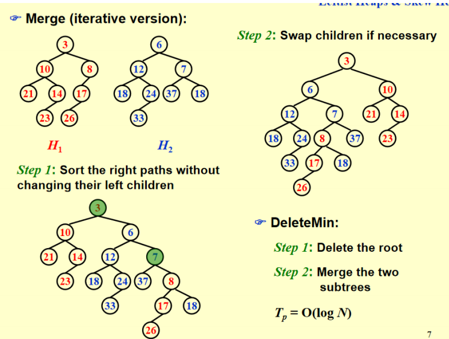

# 左式堆和斜堆
>引入这两种堆堆是为了将两个heap的merge操作加快
## Leftist Heap（左式堆，左偏树）
### 左式堆的定义和性质
这一数据结构仍然保持堆的序性质，即最小堆中父节点的值小于子节点，但不再要求完全二叉树的结构性质。
#### 零路径长（null path length, NPL）
我们把任一结点 X 的零路径长（null path length, NPL）Npl(X) 定义为从 X 到一个没有两个儿子的结点的最短路径的长。因此，具有 0 个或 1 个儿子的结点的 Npl 为 0，且规定 Npl(null)=-1。
根据这一定义，我们知道，对于一个堆（或者二叉树），我们计算每个结点的 Npl 应当从叶子结点出发向上计算，因为每个结点的 Npl 就等于它的两个孩子的 Npl 的最小值 +1。这一结论适用于没有两个孩子的结点，因为定义中 Npl(null)=-1。
#### 左式堆的结构性质
左式堆的结构性质是：每个结点的左孩子的 Npl 都要大于等于其右孩子的 Npl。注意这一定义适用于没有两个孩子的结点，因为有定义 Npl(null)=-1。
#### 左式堆的节点个数
在右路径上有 r 个结点的左式堆必然至少有 $2^r$ − 1 个结点（右路径指从根结点出发一路找右孩子直到找到叶子的路径）。
反过来，有n个节点的左式堆的右路径最多有$\lfloor \log(n+1) \rfloor$，所以我们可以将操作都放在右路经上。
#### 节点定义
```c
struct TreeNode
{
    ElementType Element;
    PriorityQueue Left;
    PriorityQueue Right;
    int Npl;
}
```

#### 左式堆的操作
##### 合并（merge）
###### 递归实现
递归实现我们分为如下步骤：
1. 如果两个堆中至少有一个是空的，那么直接返回另一个即可；
2. 如果两个堆都非空，我们比较两个堆的根结点 key 的大小，key 小的是 H1，key 大的是 H2；
3. 如果 H1 只有一个顶点（根据左式堆的定义，只要它没有左孩子就一定是单点），直接把 H2 放在 H1 的左子树就完成任务了（很容易验证这样得到的结构符合左式堆性质，此时 Npl 也没有变化）；
4. 如果 H1 不只有一个顶点，则将 H1 的右子树和 H2 合并（这是递归的体现，在 base case 设计良好，其它步骤也都合理的情况下你完全可以相信这一步递归帮你做对了），成为 H1 的新右子树；
5. 如果 H1 的 Npl 性质被违反，则交换它的两个子树；
6. 更新 H1 的 Npl，结束任务。


这个伪代码比较特别，它把整个过程拆成了两个互相调用的递归函数，实际上我们直接把第二个递归函数合并进第一个函数的代码中就会发现这就是一个普普通通的递归过程。
我们发现，在递归过程中，产生的递归层数不会超过两个左式堆的右路径长度之和，因为每次递归都会使得两个堆的其中一个（根结点 key 更小的）向着右路径上下一个右孩子推进，并且直到其中一个推到了 null 结点就不再加深递归。总而言之，两个堆右路径长度之和仍然是两个堆大小的对数级别，因此递归层数是$O(\log n)$的是准确的。
接下来分析递归返回的操作，事实上每一层的操作也是常数的，因为只需要接上新的指针，判断、交换子树以及更新 Npl，所以也是$O(\log n)$的，因此总的时间复杂度就是$O(\log n)$的。

###### 迭代实现


迭代的方法和递归的展开类似，只需要从根节点依次比较节点大小，将较大的节点较小的节点的右节点再合并，直到遇到NULL节点，然后再从右路径最后一个点返回根结点，过程中检查结构性质并更新 Npl 即可。

##### 插入（Insert）
可以视为一个堆和一个单结点的堆的 Merge，因此问题转化为 Merge。
##### 删除最小值（DeleteMin）
两个步骤实现：首先删除根结点，然后只需要将根结点的两个子树 Merge 即可。

## Skew Heap（斜堆）
斜堆与左式堆的关系就像是 splay 树和 AVL 树之间的关系。回顾 splay 树，它并不需要维护 AVL 树中的 bf 属性，只需要在访问一个结点之后就无脑地将它用 zig/zig-zig/zig-zag 三种情况将它翻到根结点即可。斜堆也是类似的想法，它不用再维护 Npl，因此在递归过程中左式堆所有维护结构性质以及更新 Npl 的操作不再需要，取而代之的是如下操作：
1. 在 base case 是处理 H 与 null 连接的情况时，左式堆直接返回 H 即可，但斜堆必须看 H 的右路径，我们要求 H 右路径上除了最大结点之外都必须交换其左右孩子。
2. 在非 base case 时，若 H1 的根结点小于 H2，如果是左式堆，我们需要合并 H1 的右子树和 H2作为 H1 的新右子树，最后再判断这样是否违反性质决定是否交换左右孩子，斜堆直接无脑交换，也就是说每次这种情况都把 H1 的左孩子换到右孩子的位置，然后把新合并的插入在 H1 的左子树上。


我们可以看上述例子，如果我们像前面分析左式堆那样展开递归的每一步，前面的过程很好理解，就是无脑交换根的 key 更小的堆的左右孩子，关键在于当递归到最深的一层我们看到实际上是merge 一个 null 堆和一个 18 为根、35 为 18 的左孩子的堆，我们看上面操作的第一条，这个堆的右路径上除了最大结点外都要交换左右孩子，但幸运的是，这个堆右路径只有 18 一个结点，它是最大的，所以无需交换。这也就是 PPT 上说从递归角度来看这里不用交换的本质原因，特别注意务必以这上面说的方法为准，在维基百科等地方的斜堆 base case 之后都无需操作，但这里可能还有操作，即可能18还有右节点，此时就需要交换18的左右节点（尽管这个例子没有，但作业题有），作业和考试务必按照这里以及 PPT 所说的操作为准！
所以类似于左式堆，我们发现最后合并出的堆的左路径上讲包含两个原始堆的右路径排序后的结果，当然后面还可能连着原始堆右路径最大值的一些左孩子（因为这些左孩子是不被交换的），因此做题的时候这一规律也是可以利用的，熟练之后不一定要按照前面递归的方式逐步分析。
### 斜堆的摊还分析
首先我们需要明确的一点是，insert 和 delete 还是以 merge 为核心，所以一系列 insert、delete、merge操作分析的关键还是 merge，因此我们只需分析 merge。

!!! 定义
    我们称一个结点 P 是重的（heavy），如果它的右子树结点个数至少是 P 的所有后代的一半（后代包括 P 自身）。反之称为轻结点（light node）。即右子树的节点个数要严格大于左子树的节点个数。

>引理：对于右路径上有 $l$ 个轻结点的斜堆，整个斜堆至少有 $2^l$ − 1 个结点，这意味着一个 n 个结点的斜堆右路径上的轻结点个数为 O(log n)。

!!! 定理
    若我们有两个斜堆 H1 和 H2，它们分别有 n1 和 n2 个结点，则合并 H1 和 H2 的摊还时间复杂度为 O(log n)，其中 n = n1 + n2。

##### 证明
我们定义势函数 $Φ(H_i)$ 等于堆 $H_i$ 的重结点（heavy node）的个数，并令 $H_3$ 为合并后的新堆.我们设 $H_i$(i = 1, 2) 的右路径上的轻结点数量为 $l_i$，重结点数量为 $h_i$，因此真实的合并操作最坏的时间复杂度为 $c_i = l_1 + l_2 + h_1 + h_2$（所有操作都在右路径上完成）。因此根据摊还分析我们知道摊还时间复杂度为
$$ \hat c_i = c_i + Φ(H_3) - (Φ(H_1) + Φ(H_2)) $$
事实上，在 merge 前我们可以记
$$ \Phi(H_1) + \Phi(H_2) = h_1 + h_2 + h $$
其中 h 表示不在右路径上的重结点个数。现在我们要考察合并后的情况，事实上我们有两个非常重要的观察：
1. 只有在 H1 和 H2 右路径上的结点才可能改变轻重状态，这是很显然的，因为其它结点合并前后子树是完全被复制的，所以不可能改变轻重状态；
2. H1 和 H2 右路径上的重结点在合并后一定会变成轻结点，这是因为右路径上结点一定会交换左右子树，并且后续所有结点也都会继续插入在左子树上（这也表明轻结点不一定变为重结点）。

结合以上两点，我们知道合并后原本不在右路径上的 h 个重结点仍然是重结点，在右路径上的 $h_1 + h_2$个重结点全部变成轻结点，$l_1 + l_2$个轻结点不一定都变重，因此合并后我们有
$$ \Phi(H_3) \leq l_1 + l_2 + h $$
代入数据计算可得
$$ \hat c_i \leq (l_1 + l_2 + h_1 + h_2) + (l_1 + l_2 + h) - (h_1 + h_2 + h) = 2(l_1 + l_2)$$
根据前面的引理，$l_1 + l_2 = O(\log n_1 + \log n_2) = O(\log(n_1 + n_2)) = O(\log n)$（这里的等号之前有完全一样的说明过），并且注意到初始（空堆）势函数一定为 0。且之后总是非负的，所以这一势函数定义满足要求，因此我们的证明也就完成了。