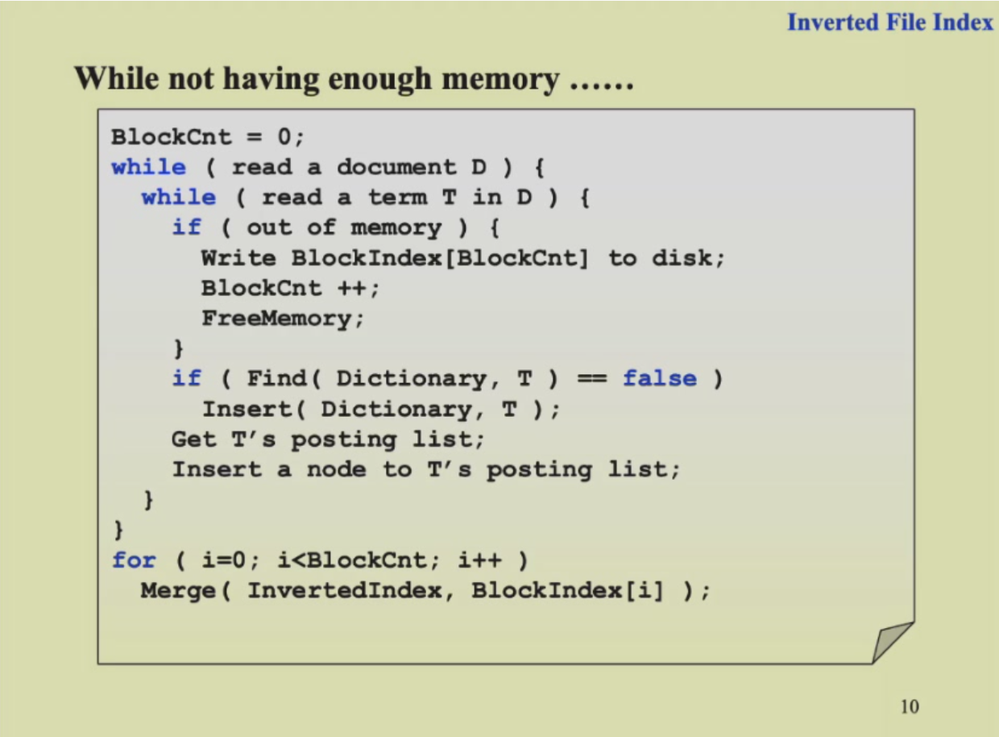
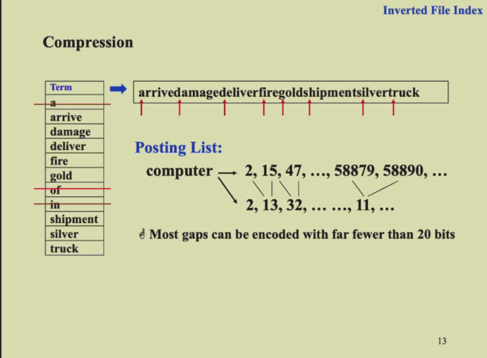
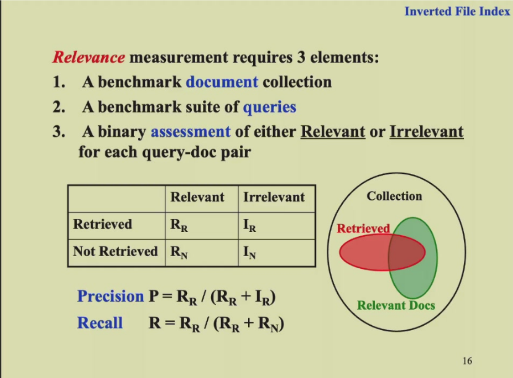
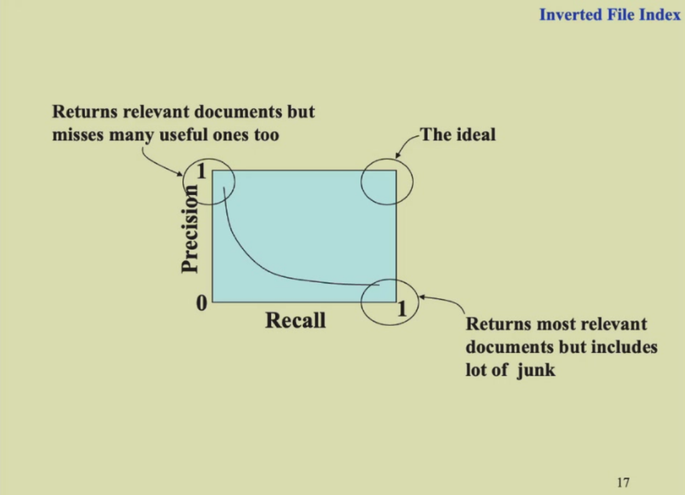

# Invert File Index（倒排索引）
## Term-Document Incidence Matrix 文档关联矩阵
- a matrix of the appearance of each word in each doc
  + 行是词，列是文档号；(i,j)表明第i个词是否在第j篇文章出现
- 如果单词在某篇文章中出现，则对应的矩阵上位置的值为1，否则为0，若干篇文章的出现情况可以得到若干个二进制字符串
  + 只关注一个单词出现与否，并不关注出现的频率，也找不出单词在文章的哪个位置
  + 一个短语调换顺序也会被找出来，不过我们不关注顺序，重要的是出现与否
- 用逻辑运算可以考察单词在doc中的出现情况
  + 位运算取交一下，快速排序，从频率低的开始交，这样效率高
  
## Inverted File Index 倒排文件索引
- Index is a mechanism for locating a given term in a text 一种在文章中定位给定单词的机制
- Inverted File contains a list of pointers to all occurrences of that term in the text
  + 索引的方式 单词---<次数；依次列出每一篇出现的doc的编号>
  + 更好的索引方式 单词----<次数；(出现的doc的编号；该doc中每一个出现的位置)>
## Index generator 索引生成器
1. 从文件中读取词
2. 将该词提取为词干(word stemming)，即去除第三人称形式、过去式、进行时等形式，留下词干），并去除分词(stop word)，即”a”, “is”等没有意义的词。
3. 检查该词是否已经在词典之中。
4. 若不在，则将该词添加入词典之中。更新索引信息。
5. 建立完毕后，将索引文件存入磁盘
   

## 使用不同的数据结构进行倒排索引
1. Hashing：一个词的时候Hash很快；花费常数时间，访问更快，但是存储不灵活，而且不适合进行范围查找（While accessing a term by hashing in an inverted file index, range searches are expensive.）
2. Search Tres(B+ trees)：范围内的搜索Search Trees更好，而且在显示应用中B+ Trees更常用。

## 存储空间不足时
### 多块内存存储
using the memory block and merge them in the end，最后合并时采用类似归并排序的方法进行。

### 分布式索引
>一部分在某一机器，另外一部分在另外一机器
- term-partitioned index 按词语来划分
- document-partitioned index 按照文档的编号来划分（第二种方法更加实用）

### 动态索引
- 文档要随时更新
- 动态索引由main index(主索引)和auxiliary index(辅助索引)构成
  + 维护两套索引，一套主索引，一套辅助索引
  + 新的文档放到辅助索引，查询(query)时两个都查询，等过一段时间再放进主索引中，删除时只会加个标记，不会真的删掉。

### Compression 压缩
- 去除掉非常频繁出现的词汇
- 把所有的term放进一个大字符串里，term只保存对应项在大字符串的位置
- 每个词在一个文章中的索引使用相对值，即两个索引间的差值。

## Thresholding 阈值，检索的优化
- document：只检索(retrieve)前面x个按权重排序的文档
  + 对于布尔查询无效（feasible，可行的）
  + 会遗漏一些重要的文档，因为有截断
- query：把带查询的terms按照出现的频率升序排序，权重赋值

## 搜索引擎的评价标准
- how fast does it index 索引有多快
  + 文档的数量/时间
- how fast does it search 搜索有多快
- Expressiveness of query language 查询语言的表现
  + 表达复杂信息的能力
  + 复杂查询的速度
- 用户的满意程度
  

## 准确率和召回率

评估相关度：
1. A benchmark document collection 基准测试集文档
2. A benchmark suite of queries 基准query
3. A binary assessment of either Relevant or Irrelevant for each query-doc pair 手工标注是否关联 构建测试集

找的这群东西里找得准不准：准确率precision $P=R_R/(R_R+I_R)$
找得全不全：召回率 recall $R=R_R/(R_R+R_N)$

