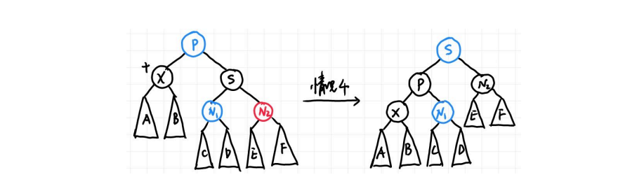

# Red-Black Trees and B+ Trees
## 1. Red-Black Trees
### 1.1 红黑树的定义
红黑树的每个节点的所连接的空指针都会连到一个哨兵节点上，哨兵节点是黑色的，且value异于常值。

红黑树共有5条性质：
- 1.红黑树是一种二叉搜索树，并且节点的颜色为红色或者黑色
- 2.红黑树的根节点是黑色
- 3.叶节点都是黑色的并且一定是NIL(叶节点总会连接一个黑色的哨兵节点)
- 4.红色节点的两个儿子一定都是黑色节点（不会出现两个红色的连在一起）
- 5.对于每一个节点，所有的从该节点出发到达后代的叶节点（NULL）的简单路径包含相同数量的黑色节点（黑高）

black height of node x 黑高:记作bh(x)，节点的black height表示从x到叶节点的路径中黑色节点的个数，不计算x自身，包括哨兵节点。bh(Tree)=bh(root)

>引理：一个拥有n个内部结点的红黑树的高度最多有2*ln(n+1)。

### 1.2 红黑树的操作
#### 1.2.1 插入insert
首先按照普通二叉搜索树的插入找到具体的位置，然后将插入的节点置为红色，如果是根节点则置为黑色。因为如果父节点是黑色的话不会破坏任何性质，所以下面讨论父节点是红色的情况。
##### 情况1:插入节点X的叔叔是红色的

X 无论左右孩子都是该情况，需要注意的是，这里所有结点都带子树，一方面至少有 NIL 结点，另一方面这可以不仅仅表示刚刚插入的情况，也可以表示经过几次调整后还在被这种情况困扰，因此更具一般性。注意 G 一定是黑色，因为 P 是红色，插入前它们就在红黑树中，因此不可能违背定义第四条。
解决方法就是直接把 X 的父亲和叔叔染黑，祖父染红，这时完全不会影响黑高，而问题也被向上推了，可以一直上推到把问题交给根节点，或者在某次上退后变成了第二或第三种情况。

##### 情况2:X 的叔叔（即父亲的兄弟）是黑色的，且 X 是右孩子
##### 情况3:X 的叔叔（即父亲的兄弟）是黑色的，且 X 是左孩子

这里借助AVL树的思想，情况2时直接将X旋转上去变成情况3，然后再旋转X以达到目的。

##### 总结

根据上述图示，可以推断出插入的时间复杂度是O(logn)，具体见wyy讲义13页。

#### 1.2.2 红黑树的删除
首先回顾普通二叉搜索树的删除：
- 1.如果 X 没有孩子，直接删除就好，没有任何后顾之忧；
- 2.如果 X 只有一个孩子，那就让孩子接替 X 的位置；
- 3.如果 X 有两个孩子，那就让 X 与其左子树的最大结点（或右子树最小结点）交换，然后删除 X（这时 X 所在的位置一定只有一个子节点，因为左子树最大结点不可能有右孩子，右子树最小结点不可能有左孩子）。

事实上红黑树的删除是基于这些操作的，需要注意的是第三种情况，X 和与其交换的结点只交换键值，不交换颜色。第三种情况可以通过一步交换直接转化为第一或第二种情况，因此我们只需要关心第一和第二种情况。

在第一种情况中，接替被删除结点所在位置的结点是 NIL，第二种则是被删除结点的子结点。如果被删除的结点是红色，事实上无事发生，没有任何性质被破坏；如果被删除的是黑色，如果接替上来的结点是红色的，直接染黑也不会破坏任何性质。接下来就是问题的关键，如果接替的是 NIL 或是黑色结点应该怎么办。

我们直接给黑色结点或者 NIL（其实也是黑色结点）再加一重黑色，于是它的颜色变成了 “双黑”。此时第五条性质没有被破坏，但是，第一条性质被破坏了！这里出现了非红也非黑的颜色！我们可以将删除的情况分成以下四类（与插入相同，这里用子树表示更一般的情况），X 在此处则表示双黑结点，图中用黑色圆圈和圆旁边的加号表示双黑，蓝色表示颜色无所谓，可红可黑。注意这里 X 都是父亲的左孩子，右孩子情况对称。

##### 情况1：X的兄弟是红色的

由于原先的树满足红黑树定义第四条，因此此时父结点一定是黑色。我们的想法很简单，兄弟是红色，那就希望兄弟能两肋插刀，把兄弟转上去，为了保持红黑树性质，很可惜只能把父亲染红。但是好处在于，这个问题转化为了接下来的情况二三四中的一种，我们来看如何解决。

##### 情况2：X 的兄弟是黑色的，且兄弟的两个孩子（根据距离划分为近、远侄子，用远近而不用左右是为了对称情况不混淆左右）都是黑色的

这时候我们把双黑往上推给父亲，兄弟也要从黑变红，如果父亲原本是红色，那就染黑，问题解决；如果父亲原本是黑色，那父亲就变成双黑，让问题向根结点靠近，如果双黑变成根节点，那只需要减一个黑色就可以了。

##### 情况 3：X 的兄弟是黑色的，且近侄子是红色的，远侄子是黑色的

这时我们借用 AVL 树的想法，红色在父亲 P 的 RL 位置，因此做 double rotation：single rotation 后会变成情况 4 的 RR 的情况（也就意味着红色要给到 RR 的位置，这里有一个颜色的变化，用 RR 记忆很方便）。

##### 情况 4：X 的兄弟是黑色的，且远侄子是红色的，近侄子颜色任意

此时对应 AVL 树的 RR，于是再一次 single rotation 即可把双黑的一重黑丢给红色远侄子（即 X 和N2 都变成黑色），但要注意为了保证红黑树性质的颜色变化，即 P 和 S 还要交换颜色，此时问题解决。

##### 总结

此时我们可以总结并计算出删除操作的时间复杂度。首先我们最多用 O(log n) 的时间找到删除结点，最多 1 次交换和 1 个删除的操作。接下来如果删除后没有问题则到此结束；否则根据分析，情况 1、3和 4 在问题解决前最多进去一次，因为 4 可以直接解决，3 直接进入 4 然后解决，1 如果进入 3 和 4也可以马上解决，进入 2 后也因为父结点是红色可以马上解决。因此关键在于情况 2 可能出现很多次，但最多也只是树高 O(log n) 次，因为每次都会上推 1 格。总而言之，因为情况 1、3 和 4 在问题解决前最多进去一次，所以最多 3 次旋转加上 O(log n) 次颜色调整可以解决问题，因此我们有如下结论：
>一棵有 n 个内部结点的红黑树删除一个结点的时间复杂度为 O(log n)。

## B+ Tree
>也是平衡树，是使用最多的平衡树
>B+树利用“空间局部性”，使用Cache优化搜索过程
>空间局限性：相邻的值在树中也是相邻的，可以方便access
>常用于数据库索引
>不是二叉树

### M阶B+树的定义
1. 根节点是叶子节点或者根节点有2~M个字节点
2. 根以外的非叶子节点（内部节点）有 $\lceil M/2 \rceil \sim M$个子节点（每个内部节点中的索引值最多只有M-1个，如下图第二层的第二个节点25,31,41，4阶B+树最多只能有3个值），每个叶节点有$\lceil M/2 \rceil \sim M$ 个键值（真正存储的元素）
   - B+树真正的元素存储在叶子中
   - 非叶子节点存储的是索引值，第n个索引值是该节点第n+1个子树中最小的值，非叶子节点会有指向子节点的指针，叶子节点每个值都会有指向后面值的指针，将叶子节点串起来
   - 左边的叶子节点元素严格小于右边叶子节点元素
3. 所有叶子节点的深度相同
4. B+ tree of order 4 也被称为2-3-4树（因为子节点的个数是2,3或4），order3的被称为2-3 tree

### B+树的操作
#### B+树的搜索
根据 B+ 树定义，需要在非叶结点层逐层和存储的键值比较从而确定去哪一个孩子结点。因此时间复杂度有两个重要因素：一个是树的高度，另一个是每一层搜索需要的时间。树的高度非常好计算，最差的情况也是每个结点都存 $\lceil M/2 \rceil$ 个节点，因此最大高度是$O(\log_{\lceil M/2 \rceil} N)$的。然后每一层因为键值是排好序的，因此用二分查找找到要去哪个孩子结点，复杂度为$O(\log_2 M)$，综合可得搜索的时间复杂度为$O({\log_2 M}\cdot{\log_{\lceil M/2 \rceil} N}) = (\log_2 {M/2+1})\cdot{\frac{\log_2 N}{\log_2 M/2}} = O(\log N)$，注意推导中使用了换底公式。

#### B+树的插入
PPT上的伪代码已经十分清楚，就是找到插入的位置，然后插入看结点是否放得下，放不下就分裂，如果分裂后子结点个数也过多则继续向上一层分裂，直到根结点孩子爆满则将根结点分裂并生成新的根结点，当然还要注意即使不分裂也可能需要按 B+ 树定义更新上层结点。我们知道树有$O(\log_{\lceil M/2 \rceil} N)$层，每层操作最多是$O(M)$（如更新结点或者分裂，无非就是更改$O(M)$个键值以及修改$O(M)$个父子指针），因此整体时间复杂度为$O(M\cdot\log_{\lceil M/2 \rceil}N) = O(\frac{M}{\log M}\log N)$ 。

!!! 注意
    有的时候如果兄弟节点有空位置的话可以将插入的元素推给兄弟节点，只是一个小trick，做题时不要用。

#### B+树的删除
PPT 没有要求，但想法很简单，因为只需把插入时分裂结点改为合并键值或孩子数量少的结点，当然需要注意的是，为了确保合并后键值数量不会超过 M 且减少合并次数，可以先看看兄弟结点是不是键值还很多，多的话拿一个过来即可，事实上整体时间复杂度和插入分析类似，也为$O(\frac{M}{\log M}\log N)$ 。

