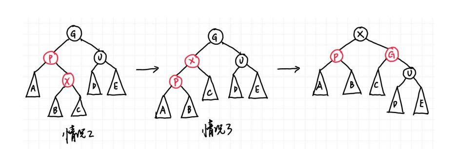

# Red-Black Trees and B+ Trees
## 1. Red-Black Trees
### 1.1 红黑树的定义
红黑树的每个节点的所连接的空指针都会连到一个哨兵节点上，哨兵节点是黑色的，且value异于常值。

红黑树共有5条性质：
- 1.红黑树是一种二叉搜索树，并且节点的颜色为红色或者黑色
- 2.红黑树的根节点是黑色
- 3.叶节点都是黑色的并且一定是NIL(叶节点总会连接一个黑色的哨兵节点)
- 4.红色节点的两个儿子一定都是黑色节点（不会出现两个红色的连在一起）
- 5.对于每一个节点，所有的从该节点出发到达后代的叶节点（NULL）的简单路径包含相同数量的黑色节点（黑高）

black height of node x 黑高:记作bh(x)，节点的black height表示从x到叶节点的路径中黑色节点的个数，不计算x自身，包括哨兵节点。bh(Tree)=b(root)

>引理：一个拥有n个内部结点的红黑树的高度最多有2*ln(n+1)。

### 1.2 红黑树的操作
#### 1.2.1 插入insert
首先按照普通二叉搜索树的插入找到具体的位置，然后将插入的节点置为红色，如果是根节点则置为黑色。因为如果父节点是黑色的话不会破坏任何性质，所以下面讨论父节点是红色的情况。
##### 情况1:插入节点X的叔叔是红色的

X 无论左右孩子都是该情况，需要注意的是，这里所有
结点都带子树，一方面至少有 NIL 结点，另一方面这可以不仅仅表示刚刚插入的情况，也可以表示经过几次调整后还在被这种情况困扰，因此更具一般性。注意 G 一定是黑色，因为 P 是红色，插入前它们就在红黑树中，因此不可能违背定义第四条。
解决方法就是直接把 X 的父亲和叔叔染黑，祖父染红，这时完全不会影响黑高，而问题也被向上推了，可以一直上推到把问题交给根节点，或者在某次上退后变成了dier或第三种情况。

##### 情况2:X 的叔叔（即父亲的兄弟）是黑色的，且 X 是右孩子
##### 情况3:X 的叔叔（即父亲的兄弟）是黑色的，且 X 是左孩子

这里借助AVL树的思想，情况2时直接将X旋转上去变成情况3，然后再旋转X以达到目的。

##### 总结

根据上述图示，可以推断出插入的时间复杂度是O(logn)，具体见wy讲义13页。

#### 1.2.2 红黑树的删除
首先回顾普通二叉搜索树的删除：
- 1.如果 X 没有孩子，直接删除就好，没有任何后顾之忧；
- 2.如果 X 只有一个孩子，那就让孩子接替 X 的位置；
- 3.如果 X 有两个孩子，那就让 X 与其左子树的最大结点（或右子树最小结点）交换，然后删除 X（这时 X 所在的位置一定只有一个子节点，因为左子树最大结点不可能有右孩子，右子树最小结点不可能有左孩子）。

事实上红黑树的删除是基于这些操作的，需要注意的是第三种情况，X 和与其交换的结点只交换键值，不交换颜色。第三种情况可以通过一步交换直接转化为第一或第二种情况，因此我们只需要关心第一和第二种情况。

在第一种情况中，接替被删除结点所在位置的结点是 NIL，第二种则是被删除结点的子结点。如果被删除的结点是红色，事实上无事发生，没有任何性质被破坏；如果被删除的是黑色，如果接替上来的结点是红色的，直接染黑也不会破坏任何性质。接下来就是问题的关键，如果接替的是 NIL 或是黑色结点应该怎么办。

我们直接给黑色结点或者 NIL（其实也是黑色结点）再加一重黑色，于是它的颜色变成了 “双黑”。此时第五条性质没有被破坏，但是，第一条性质被破坏了！这里出现了非红也非黑的颜色！我们可以将删除的情况分成以下四类（与插入相同，这里用子树表示更一般的情况），X 在此处则表示双黑结点，图中用黑色圆圈和圆旁边的加号表示双黑，蓝色表示颜色无所谓，可红可黑。注意这里 X 都是父亲的左孩子，右孩子情况对称。

##### 情况1：X的兄弟是红色的

由于原先的树满足红黑树定义第四条，因此此时父结点一定是黑色。我们的想法很简单，兄弟是红色，那就希望兄弟能两肋插刀，把兄弟转上去，为了保持红黑树性质，很可惜只能把父亲染红。但是好处在于，这个问题转化为了接下来的情况二三四中的一种，我们来看如何解决。

##### 情况2：X 的兄弟是黑色的，且兄弟的两个孩子（根据距离划分为近、远侄子，用远近而不用左右是为了对称情况不混淆左右）都是黑色的

这时候我们把双黑往上推给父亲，兄弟也要从黑变红，如果父亲原本是红色，那就染黑，问题解决；如果父亲原本是黑色，那父亲就变成双黑，让问题向根结点靠近，如果双黑变成根节点，那只需要减一个黑色就可以了。

##### 情况 3：X 的兄弟是黑色的，且近侄子是红色的，远侄子是黑色的

这时我们借用 AVL 树的想法，红色在父亲 P 的 RL 位置，因此做 double rotation：single rotation 后会变成情况 4 的 RR 的情况（也就意味着红色要给到 RR 的位置，这里有一个颜色的变化，用 RR 记忆很方便）。

##### 情况 4：X 的兄弟是黑色的，且远侄子是红色的，近侄子颜色任意

此时对应 AVL 树的 RR，于是再一次 single rotation 即可把双黑的一重黑丢给红色远侄子（即 X 和N2 都变成黑色），但要注意为了保证红黑树性质的颜色变化，即 P 和 S 还要交换颜色，此时问题解决。

##### 总结

此时我们可以总结并计算出删除操作的时间复杂度。首先我们最多用 O(log n) 的时间找到删除结点，最多 1 次交换和 1 个删除的操作。接下来如果删除后没有问题则到此结束；否则根据分析，情况 1、3和 4 在问题解决前最多进去一次，因为 4 可以直接解决，3 直接进入 4 然后解决，1 如果进入 3 和 4也可以马上解决，进入 2 后也因为父结点是红色可以马上解决。因此关键在于情况 2 可能出现很多次，但最多也只是树高 O(log n) 次，因为每次都会上推 1 格。总而言之，因为情况 1、3 和 4 在问题解决前最多进去一次，所以最多 3 次旋转加上 O(log n) 次颜色调整可以解决问题，因此我们有如下结论：
>一棵有 n 个内部结点的红黑树删除一个结点的时间复杂度为 O(log n)。

